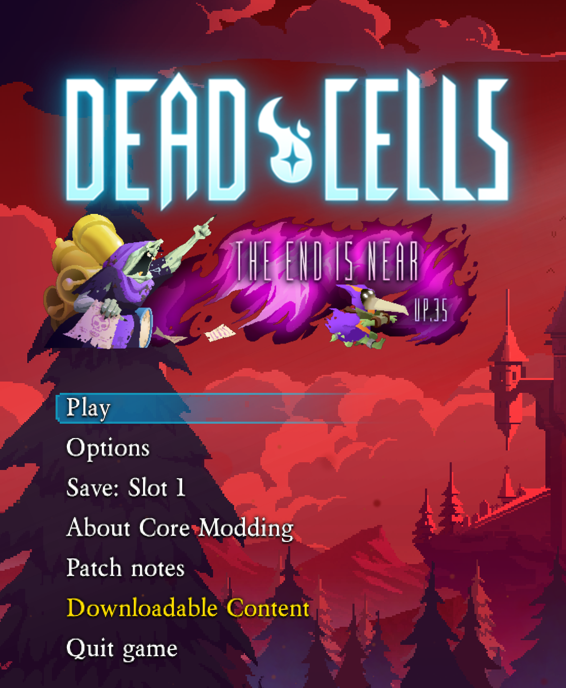

# Dynamic Core Modding with DCCM (For Developers)

:::warning

This is an advanced tutorial! If you're only looking to play mods made with DCCM, check [this alternate, less technical tutorial](/tutorials/dccm_player.md)

:::

## Prerequisites

This tutorial assumes you are familiar with the basics of programming and the command-line and are at least somewhat familiar with Hashlink, the VM that Dead Cells is compiled to. Other than the base game, you'll only need:

- A .NET 9 SDK
  - Optionally, you can install Visual Studio - this can be helpful with development but is, strictly speaking, not neccesary
- Git

:::info

This tutorial assumes you're on Windows. There's no provided prebuilt binaries of DCCM for Linux yet - but it *should* be supported if you want to compile it yourself.

:::

## What is DCCM? How does it work?

DCCM, or Dead Cells Core Modding, is a .NET-based modding framework for Dead Cells that works by hooking and injecting into a custom version of the Hashlink VM to allow mods to intercept and modify the behavior of various functions in the bytecode. It was written by HKLab - so major thanks to him!

## Installing DCCM

This will happen in two stages, since we're developing mods too - we need to copy the prebuilt mod runtime over our Dead Cells game directory, and then we need to install the SDK so we can access from other places.

### Game Directory

Open up your game directory in your favorite file explorer. Then, go download the [latest release of DCCM](https://github.com/dead-cells-core-modding/core/releases).

Make a subdirectory in the root of your game directory - call it `coremod`. Unzip the contents of the DCCM release to that directory. It should look like:

```
<DeadCellsGameRoot>
├─ coremod
│  ├─ core
│  │  ├─ native
│  │  │  └─ …
│  │  ├─ mdk
│  │  │  ├─ install.ps1
│  │  │  ├─ uninstall.ps1
│  │  │  └─ …
│  │  ├─ host
│  │  │  ├─ startup
│  │  │  │  ├─ DeadCellsModding.exe
│  │  │  │  └─ …
│  │  │  └─ …
│  │  └─ …
│  └─ …
├─ deadcells.exe
├─ deadcells_gl.exe
└─ …
```

Now, let's test and make sure it's functional. Find `coremod/core/host/startup/DeadCellsModding.exe` and run it to launch the game.

:::tip

When launching the game from now on, if you run `deadcells.exe`, the vanilla game will launch. Running the launcher in `coremod/core/host/startup/` is the only way to launch the game modded.

:::

When you launch the game, you should see a new menu item labeled "About Core Modding". If you don't, then DCCM wasn't installed correctly.



### SDK

Let's install the SDK now! Open ***Powershell*** (Note: it needs to be Powershell and not `cmd.exe`!) in the game directory and run:

```ps1
cd coremode\core\mdk\
.\install.ps1
```

This should output:

```output
Package source with Name: DeadCoreModdingMDK added successfully.
```

## Developing Mods

TODO!
